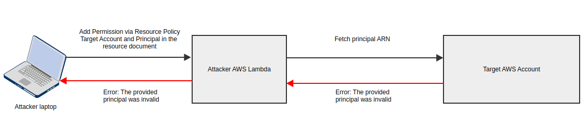
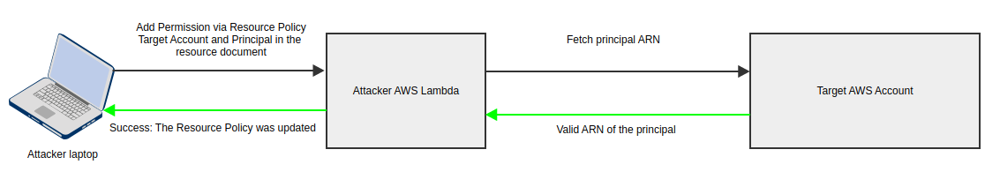
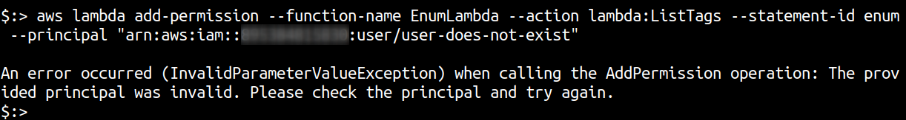
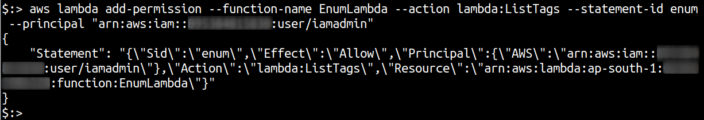
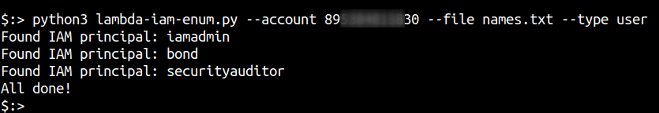

# Cross Account IAM enumeration via Lambda Resource Policies in AWS 

## Background

AWS Identity and Access Management (IAM ) in many ways is the gatekeeper for resources on AWS. IAM mismanagement, leakage of credentials etc. can result in attackers gaining access to AWS services and subsequently the data and functionality they expose.

AWS IAM consists of many different types of access control entities. Users, roles, policies, groups, identity providers etc. Each of these entities can be applied to various resources within AWS to create access gates for the service that is being executed. Here are couple of examples
An IAM user can login to the AWS console using a username and password or access the AWS APIs programmatically using an access key and secret
A process running on an EC2 instance, wanting to write files to an S3 bucket, can generate temporary tokens by accessing the instance metadata endpoint, of an IAM Role attached to the EC2 instance

In each case, for a user or a role, a permissions policy statement is attached that defines the kind of access the user or role will have. Hence, when attempting to attack an AWS account, it's always useful to know what kind of users, groups and roles exist on the target. An attacker can use the user or role identified to perform additional attacks, using misconfigured roles and users with weak passwords and no 2FA.

This post details a technique that uses the “Add Permission” feature in AWS Lambda to identify AWS IAM users and roles across a different AWS account without requiring any access to it. This feature essentially adds or updates a resource policy document to the lambda and can be used to leak information about IAM users and roles from a different AWS account based on error messages. Largely inspired by [Daniel Grzelak’s](https://www.youtube.com/watch?v=8ZXRw4Ry3mQ) research but using Lambda as a resource.

## Fetching AWS Account IDs

To abuse the “Add Permission” feature in AWS Lambda to enumerate IAM users and roles across a different AWS account, we need to have the target AWS Account ID. Although not sensitive in isolation, the AWS Account ID can be used to chain other attacks in AWS. 

In our experience, AWS account IDs are leaked through various means, some of which include

- Client side JavaScript in web apps using some AWS resource in the backend
- Mobile app code post reverse engineering
- GitHub and other source code repositories
- Public help forums - stackoverflow, dev.to etc.
- Public EBS and RDS snapshots
- Public AMIs
- Blog posts (and other content on the web) texts and screenshots
- Social Engineering

## Abusing AWS Lambda to enumerate IAM

Like most IAM enumeration techniques [previously](https://rhinosecuritylabs.com/aws/assume-worst-aws-assume-role-enumeration/) [discovered](https://rhinosecuritylabs.com/aws/aws-iam-user-enumeration/) and [documented](https://rhinosecuritylabs.com/aws/aws-role-enumeration-iam-p2/), this technique also involves working with AWS error messages, essentially using a side channel to verify a true or false condition.

Once you have the account ID we are ready for the attack. As this is a side channel enumeration technique, you will require a list of potential user names and role names that can be tried against an AWS account. This attack will be launched using a lambda created within your own account.

The enumeration attack can be visualized as follows

**Invalid user/role**



**Valid user/role**



Let’s see how we can do the attack first with the help of AWS commands, followed by a script that can automate the enumeration

## Pre-requisites

1. Target AWS Account ID
2. A new lambda function in your own AWS account. The code and language are irrelevant
3. A list of potential user names and roles you want to try against the target AWS account. You can use the default word list from Pacu for [users](https://github.com/RhinoSecurityLabs/pacu/blob/master/pacu/modules/iam__enum_users/default-word-list.txt) and [roles](https://github.com/RhinoSecurityLabs/pacu/blob/master/pacu/modules/iam__enum_roles/default-word-list.txt)
4. AWS cli configured for your own account. If using profiles, make sure AWS_PROFILE is set in your environment

## The enumeration attack

Assuming your lambda function is called `EnumLambda`, and the target AWS Account ID is `111111111111`, the attack steps to verify this technique are as follows

- Attempt to add a non-existent principal from the target AWS account to the Lambda and note the error in the response

```
aws lambda add-permission --function-name EnumLambda --action lambda:ListTags --statement-id enum" --principal "arn:aws:iam::111111111111:user/user-does-not-exist

An error occurred (InvalidParameterValueException) when calling the AddPermission operation: The provided principal was invalid. Please check the principal and try again.
```



- Attempt to add a valid principal in the target account

```
aws lambda add-permission --function-name EnumLambda --action lambda:ListTags --statement-id enum --principal "arn:aws:iam::111111111111:user/iamadmin"
{
   "Statement": "{\"Sid\":\"teststatement\",\"Effect\":\"Allow\",\"Principal\":{\"AWS\":\"arn:aws:iam::111111111111:user/iamadmin\"},\"Action\":\"lambda:ListTags\",\"Resource\":\"arn:aws:lambda:us-east-1:12345678901:function:EnumLambda\"}"
}
```



- Clean up after each successful user or role discovery using remove-permission

```
aws lambda remove-permission --function-name EnumLambda  --statement-id enum
```

## Automating the attack

You can grab the script to perform this attack from our Github here.


